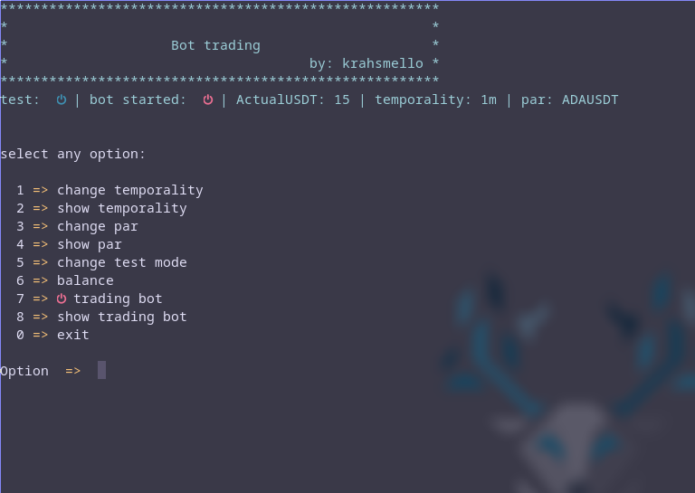
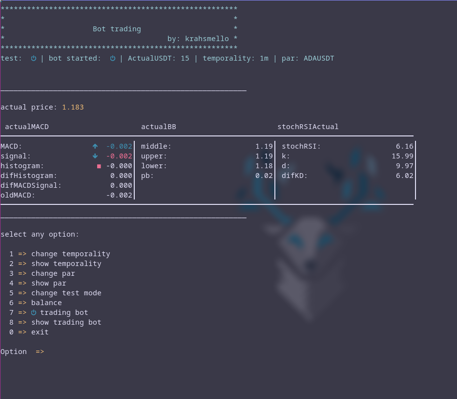

# trading-bot

this is my trading bot make whit javascript 

# Requirement

- [node v16.14.2](https://nodejs.dev/) 
- [nerdfont](https://www.nerdfonts.com/font-downloads)
- have knowledge in javascript

# about the bot

The bot have an test mode if it is active, when this option is active it does not perform operations in **the binance exange** perfect to testing you strategi, the bot is just programe for operate in binance spot for now

 - for beging need configurate the APYKEY and APYSECRECT of binance api in the dotenv

 - the bot in the first time to start the serve is off for active need use the option 7 

 - in the option 8 can look the indicator 

